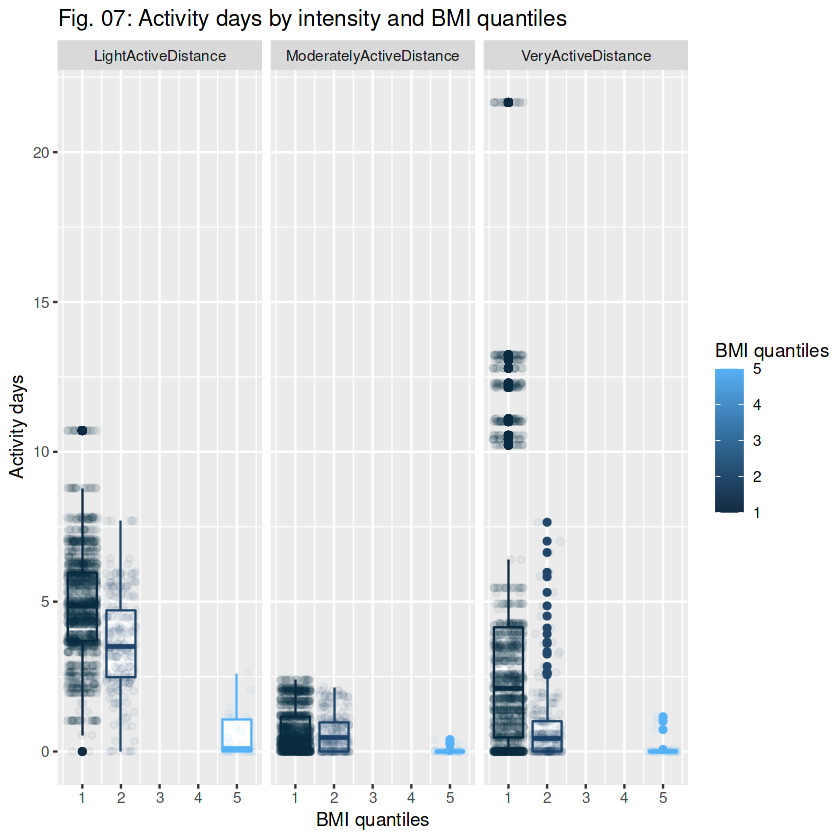

# Objetivo del proyecto

El objetivo es conocer las principales métricas obtenidas gracias a un producto "watch" y como se podría ayudar al desarrollo del plan de marketing de la empresa gracias a los datos obtenidos

# Origen de los datos

Todos los datos necesarios están subidos en un repositorio de Kaggle (https://www.kaggle.com/datasets/arashnic/fitbit)

# Programas y paquetes

Todo el análisis en R, paquetes principales: tidyverse, dplyr, tidyr, ggplot2, lubridate y scales.

# Procesos realizados

1. Comparación y unión de bases de datos.
2. Limpieza de datos (nulls y cambios de formato)
3. Creación de gráficos con agrupación
4. Segmentación de los datos por percentiles

# Resultado del análisis

## Steps:
 

## Sleep and asleep time:
 

## Quality of sleep after each activity:

## Exercise by BMI quantile:
 

# Lecciones aprendidas y recomendaciones

1. Recalcular fórmulas omitiendo errores
2. Visualización de datos de nuevas formas
3. División por percentiles de los datos

# Limitaciones y qué puede ser mejorado

En este dataset tuve el problema contrario, en muchos datos tuve tan sólo la información de 30 usuarios, por lo que las métricas debían de ser mucho más precisas, intentando responder a las preguntas con la máxima información que podía sacar. En algunos aspectos no he podido responder porque carecía de datos, así que mis clonclusiones en ese aspecto han sido que convendría ampliar la base de datos para confirmar nuestras hipótesis.
